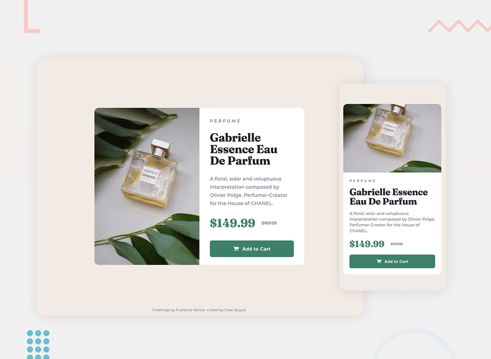

# Frontend Mentor - Product preview card component solution

This is a solution to the [Product preview card component challenge on Frontend Mentor](https://www.frontendmentor.io/challenges/product-preview-card-component-GO7UmttRfa). Frontend Mentor challenges help you improve your coding skills by building realistic projects.

## Table of contents

- [Overview](#overview)
  - [Screenshot](#screenshot)
  - [Links](#links)
  - [Built with](#built-with)
- [Author](#author)

## Overview

### Screenshot

### Links

- Solution URL: [https://github.com/cokecancook/cokecancook.github.io/tree/main/product-preview-card-componentproduct-preview-card-component](https://github.com/cokecancook/cokecancook.github.io/tree/main/product-preview-card-component)
- Live Site URL: [https://cokecancook.github.io/product-preview-card-component](https://cokecancook.github.io/product-preview-card-component)

### Built with

- Semantic HTML5 markup
- CSS custom properties
- Flexbox
- Mobile-first workflow

## Author

- Website - [Coke Stuyck](https://cokecancook.github.io)
- Frontend Mentor - [@cokecancook](https://www.frontendmentor.io/profile/cokecancook)
